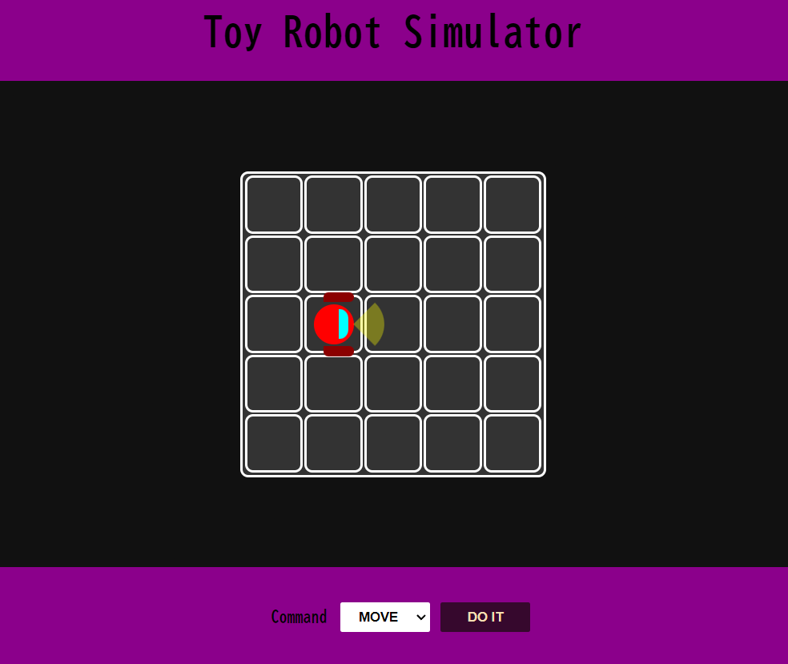

# Toy Robot Simulator

## Table of contents:

* [Description](./README.md#description)
* [Example Input and Output](./README.md#example-input-and-output)
* [Setup](./README.md#setup)

## Description

* The application is a simulation of a toy robot moving on a square tabletop, of dimensions 5x5. Having a CLI option and also a web version.

* There are no other obstructions on the table surface.

* The robot is free to roam around the surface of the table, but can't fall to destruction.

### Command Line Interface (CLI)

```
PLACE X,Y,F
MOVE
LEFT
RIGHT
REPORT
```

* `PLACE` will put the toy robot on the table in position X,Y and facing NORTH, SOUTH, EAST or WEST.

* The first valid command to the robot is a `PLACE` command, after that, any sequence of commands will be issued, in any order, including another `PLACE` command. The application will discard all commands in the sequence until a valid `PLACE` command has been executed

* `MOVE` will move the toy robot one unit forward in the direction it is currently facing.

* `LEFT` and `RIGHT` will rotate the robot 90 degrees in the specified direction without changing the position of the robot.

* `REPORT` will announce the position of the robot.
#
### Example Input and Output:

#### Example a

    PLACE 0,0,SOUTH
    MOVE
    REPORT

Expected output:

    0,1,SOUTH

#### Example b

    PLACE 0,0,SOUTH
    LEFT
    REPORT

Expected output:

    0,0,EAST

#### Example c

    PLACE 1,2,EAST
    MOVE
    MOVE
    RIGHT
    MOVE
    REPORT

Expected output

    3,3,SOUTH

## Setup
### CLI Experience
- pre-reqs: node
- clone or download project
###
- run `npm install`
- run `npm run dev` for development mode
####  or
- run `npm install`
- run `npm run build`
- run `npm run start` for production mode
#
### Web Experience
- [access it by clicking here](https://toyrobotsim.web.app/)
#### or
- pre-reqs: node, any browser
- clone or download project
- run `npm install`
- run `npm run build`
- open the HTML file (`dist/index.html`) with any internet browser


    